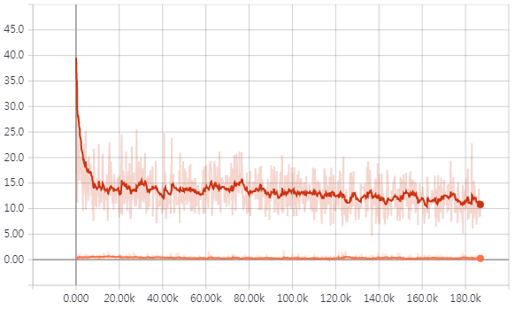
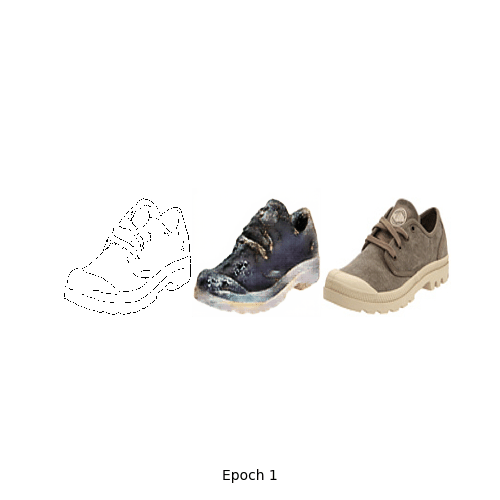

# sketch

The app takes a sketch of the shoe as an input and returns an image of a similar shoe.

## Model
The model is based on the edges2shoes algorithm which is based on the [pix2pix](https://phillipi.github.io/pix2pix/) algorithm.
- Image size: **256x256**
- Number of training images: **2000**
- Number of epochs: **1**
- Batch size: **1**

[Used dataset](https://www.dropbox.com/s/1ocauh7i6biuka9/shoesnp.npz?dl=0): 2000 training images (256x256).  
[Pretrained model](https://www.dropbox.com/s/iy69luldj3ljxvh/shoes_model.zip?dl=0): 1 epoch with dataset above.  
[Original dataset](https://people.eecs.berkeley.edu/~tinghuiz/projects/pix2pix/datasets/): 50000 training images.  
Recommended amount of epochs with original dataset: **15-30**.

## Results
* [Reference](https://github.com/togheppi/pix2pix#results-1)
* Adam optimizer is used. Learning rate = 0.0002, batch size = 4, # of epochs = 15:

GAN losses  (  : Generator /  : Discriminator) | Generated images (Input / Generated / Target)
:---:|:---:
 | 

* Generated images using test data

    |1st column: Input / 2nd column: Generated / 3rd column: Target|
    |:---:|
    ||
    ||
    ||
    ||
